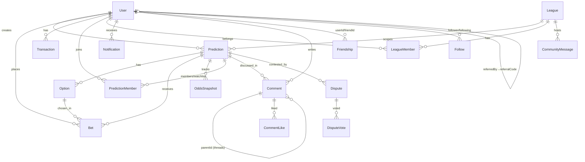

# Sawa — Database Technical Map

> **Single source of truth for the live Sawa Postgres/Supabase database.** Use this to know
> *what* data exists and *where* it lives before writing any query, bot reader, or migration.
> Generated by live introspection of the production database on **2026-06-18**.
>
> ⚠️ The application schema is **Prisma-managed and lives in a separate repo** (the Next.js web
> app). This repo (`messagesApp`) is a read-only discovery-bot scaffold. The **live database is
> the authoritative source** for this map — there are no Supabase migration files to read.

---

## 1. Connection & project facts

| Property | Value |
|---|---|
| Project name | **Sawa** |
| Project ref / ID | `vmuuxsjafmkcdrcxouot` |
| API base URL | `https://vmuuxsjafmkcdrcxouot.supabase.co` |
| PostgREST REST base | `https://vmuuxsjafmkcdrcxouot.supabase.co/rest/v1/` |
| DB host | `db.vmuuxsjafmkcdrcxouot.supabase.co` |
| Postgres version | **17.6** (engine 17, GA channel) |
| Region | `us-west-2` |
| Created | 2025-12-17 |
| Schema mgmt | **Prisma** (PascalCase tables, camelCase columns, `cuid` text IDs) |
| Supabase migrations | **none tracked** (Prisma owns DDL) |
| Edge functions | **none** |

**Auth headers for the REST API** (PostgREST): `apikey: <key>` **and** `Authorization: Bearer <key>`.
The publishable/anon key reaches all `public` tables (see §2). Secrets live in a `0600` env file,
never committed — only env-var *names* (`SAWA_SUPABASE_URL`, `SAWA_SUPABASE_KEY`) appear in this repo.

---

## 2. ⚠️ Critical operational notes (read first)

1. **RLS is DISABLED on all 37 tables.** Every table in `public` is exposed to the `anon`/`authenticated`
   roles via PostgREST — **anyone with the anon key can read/write every row**. Security is currently
   enforced entirely in the application layer (the Next.js API), not the database. The Supabase linter
   flags this as 37× `rls_disabled_in_public` (ERROR).
2. **Sensitive columns are exposed without RLS** (linter `sensitive_columns_exposed`, ERROR):
   - `User.password` (bcrypt/argon hash), plus PII: `email`, `phone`, `googleId`, `venmoUsername`, `country`.
   - `PasswordResetToken.token`, `VerificationToken.token` — live auth tokens readable via the API.
   - **Bot/PII guardrail:** any read-only reader must hard-code a column allowlist and **never** select
     `User.password/email/phone/googleId` or token tables.
3. **No native enums.** Every `status` / `type` / `category` / `role` field is plain `text` with an
   application-enforced vocabulary. See §6 for the observed value catalog (mined from live data).
4. **No database functions, triggers, or column comments.** All business logic (odds, payouts, balance
   updates, `updatedAt` stamping, cascade side-effects beyond FK rules) lives in the app, not the DB.
5. **IDs are `text`** — do not assume UUID format. ⚠️ Nuance: many existing **row values** are cuid-format
   (legacy), but the **current `schema.prisma` generates `@default(uuid())`** on all 38 tables (new rows are
   uuid-format). **New tables should use `@default(uuid())`** to match the live generator — not `cuid()`.
6. **All timestamps are `timestamp without time zone`** (no TZ). `createdAt` defaults to `CURRENT_TIMESTAMP`;
   `updatedAt` has **no DB default** (Prisma `@updatedAt` sets it in app code) — inserts that bypass Prisma
   must set `updatedAt` explicitly or they fail (`NOT NULL`).
7. **Monetary values are integer "Sawa coins"**, never USD. The platform is deliberately virtual.

---

## 3. Live platform configuration (`PlatformSettings`, singleton `id='default'`)

These are the **actual live values** (which differ from the table's schema defaults — the row was tuned):

| Setting | Live value | Schema default |
|---|---|---|
| `platformMode` | `virtual` | `virtual` |
| `virtualCurrencyName` | `Sawa coins` | `Sawa coins` |
| `feePercent` | **1** | 2.5 |
| `monthlyGrantAmount` | **1000** | 100 |
| `maxBetAmount` | **100** | 10000 |
| `highStakesThreshold` | 500 | 500 |
| `earlyBirdBonusWeight` | 0.3 | 0.3 |
| `freeTierCreateLimit` | **5** | 3 |
| `freeTierJoinLimit` | 10 | 10 |
| `premiumTierCreateLimit` / `premiumTierJoinLimit` | 20 / 50 | 20 / 50 |
| `bettingEnabled` / `predictionsEnabled` / `discoverEnabled` / `signupsEnabled` | all `true` | true |
| `premiumEnabled` | `false` (price 7.0) | false |
| `maintenanceMode` | `false` | false |

> When code needs a platform-wide flag (fees, limits, kill-switches, social URLs, maintenance banners),
> it lives here — one row, `id='default'`.

---

## 4. Table inventory by domain (with live row counts)

37 tables, all in `public`. Counts are exact live tuples as of generation.

**Identity & Auth** — `User` (315), `VerificationToken` (94), `PasswordResetToken` (1), `PushSubscription` (0), `UserEmailSent` (0)

**Core markets** — `Prediction` (78), `Option` (258), `Bet` (309), `OddsSnapshot` (1177), `PredictionMember` (210), `PredictionReaction` (0), `PredictionTemplate` (12), `PriceAlert` (0)

**Resolution & disputes** — `Dispute` (0), `DisputeVote` (0)

**Economy** — `Transaction` (458), `Debt` (4), `UserQuest` (9)

**Social graph & engagement** — `Friendship` (6), `Follow` (0), `Comment` (13), `CommentLike` (1), `Notification` (588)

**Leagues / communities** — `League` (14), `LeagueMember` (141), `CommunityMessage` (5)

**Head-to-head** — `Challenge` (0)

**Growth / ambassadors** — `Ambassador` (0), `AmbassadorApplication` (0)

**CMS / admin / platform** — `PlatformSettings` (1), `SiteContent` (3), `FAQ` (8), `EmailTemplate` (12), `Announcement` (1), `HelpRequest` (0), `AdminAction` (98)

**External channels** — `WhatsAppInbound` (30)

Highest-volume tables: `OddsSnapshot`, `Notification`, `Transaction`, `User`, `Bet`, `Option`.

---

## 5. Entity-relationship overview

`User` and `Prediction` are the two hubs. Every FK ultimately hangs off one of them.



**Cascade behavior (FK `ON DELETE`):**
- Deleting a `Prediction` **cascades** to its `Option`, `Bet`, `OddsSnapshot`, `Comment`,
  `PredictionMember`, `PredictionReaction`, `PriceAlert`, `Dispute`; **sets null** on `WhatsAppInbound.predictionId`.
- Deleting a `League` **cascades** to `LeagueMember` & `CommunityMessage`; **sets null** on
  `Prediction.leagueId` and `Challenge.leagueId`.
- Most `userId` FKs are `ON DELETE RESTRICT` (a user with bets/comments/predictions can't be hard-deleted —
  the app uses `isBlocked`/`isGhost` flags instead). Pure-derived rows (`Follow`, `Ambassador`,
  `PushSubscription`, `UserEmailSent`, `UserQuest`, `PredictionReaction`, `PriceAlert`) are `CASCADE`.

### Soft references (column exists, **no FK constraint** — do not rely on referential integrity)
- `Prediction.winningOptionId` → `Option.id`
- `OddsSnapshot.optionId` → `Option.id` (only `predictionId` is a real FK)
- `Notification.predictionId` → `Prediction.id`
- `Transaction.predictionId` → `Prediction.id`
- `PriceAlert.optionId` → `Option.id` (only `userId`/`predictionId` are FKs)
- `Debt.predictionId` (nullable), `Debt.leagueId` (nullable), `Debt.createdById` (**NOT NULL** — required, but still no FK) — only `creditorId`/`debtorId` are real FKs

---

## 6. Value catalog for text "enum" fields (mined from live data)

There are **no Postgres enums**; these are the observed `text` values. Defaults in **bold**.

| Field | Observed values (live counts) |
|---|---|
| `User.role` | **user** (310), superadmin (3), creator (2) |
| `User.subscriptionTier` | **free** (315) — premium reserved, gated by `premiumEnabled` |
| `Prediction.category` | **other** (40), sports (11), entertainment (7), personal (6), economics (5), world (4), tech (2), politics (2), culture (1) |
| `Prediction.disputeStatus` | **none** (78) — also `active`/`resolved` per app logic |
| `Transaction.type` | bet_placed (374), creator_stake (68), quest_reward (9), admin_deposit (3), admin_withdrawal (1), fee_collected (1), stake_returned (1), payout (1) |
| `Notification.type` | community_prediction (180), bet_placed (101), prediction_placed (99), resolved (70), comment (69), community_join_request (35), friend_prediction (14), you_won (8), friend_request (7), announcement (4), prediction_resolved (1) |
| `Friendship.status` | **pending** (4), accepted (2) — also `rejected`/`blocked` |
| `LeagueMember.role` | **member** (126), admin (15) |
| `LeagueMember.status` | **approved** (139), pending (2) |
| `PredictionMember.status` | **approved** (210) |
| `Debt.status` | **pending** (4) |
| `WhatsAppInbound.status` | processed (29), failed (1) — default **pending** |
| `AdminAction.action` | delete_prediction, hide_prediction, force_resolve, edit_league, delete_league, create/update/delete_announcement, bulk_limit_boost, bulk_balance_adjustment, bulk_notify |
| `AdminAction.targetType` | prediction (47), announcement (34), league (9), user (8) |
| `UserQuest.questType` | trade (5), create (4) |
| `EmailTemplate.type` | welcome, welcome_d1/d2/d4/d7/d14/d21, verification, password_reset, prediction_resolved, prediction_placed, you_won (12 unique) |
| `PredictionTemplate.category` | crypto, politics, personal, sports |
| `Announcement.type` | **announcement** |
| `PlatformSettings.platformMode` | **virtual** |

---

## 7. Per-table reference

Notation: `col :: type` · `PK` primary key · `FK→` foreign key · `U` unique · `IX` non-unique index ·
all `id` columns are `text` cuid PKs. `(unindexed FK)` flags an FK with no covering index (see §8).

### Identity & Auth

#### `User` — 315 rows · the account record & wallet
Columns: `id`, `username`(U, NOT NULL), `password`(null, hash), `balance`::int DEFAULT 100,
`profilePicture`, `role`::text DEFAULT 'user', `email`(U, null), `emailVerified`::bool DEFAULT false,
`emailNotifications`/`pushNotifications`/`notifyOnBet`/`notifyOnComment`/`notifyOnDeadline`/`notifyOnFriend`/`notifyOnResolve`/`notifyOnWin`::bool DEFAULT true,
`googleId`(U, null), `phone`(U, null), `country`, `subscriptionTier`::text DEFAULT 'free', `subscriptionExpiry`,
`isBlocked`/`blockedAt`/`blockedReason`, `isGhost`::bool DEFAULT false, `hostFlagCount`::int DEFAULT 0,
`canComment`::bool DEFAULT true / `commentBannedAt` / `commentBannedBy`,
`termsAcceptedAt`, `hasSetUsername`::bool, `hasSeenCoinsIntro`::bool, `defaultAnonymousBets`::bool, `hideProfileActivity`::bool,
`preferredSectors`::text[] DEFAULT '{}', `monthlyResetDate`, `predictionsCreatedThisMonth`/`predictionsJoinedThisMonth`::int DEFAULT 0,
`limitBoostCreate`/`limitBoostJoin`::int DEFAULT 0 / `limitBoostExpiresAt`,
`referralCode`(U, null), `referredBy`(null) **FK→** `User.referralCode` (unindexed FK) / `referredAt`,
`currentStreak`/`longestStreak`::int DEFAULT 0, `lastTradeDate`/`lastShareDate`, `lastInboundAt`,
`venmoUsername`, `passwordChangedAt`, `createdAt` DEFAULT now.
- **PK** id · **U**: username, email, googleId, phone, referralCode · **IX**: (the 5 uniques)
- Notes: self-referential referral via `referralCode` (not `id`). Wallet = `balance` (coins). Soft-delete via `isBlocked`/`isGhost`.

#### `VerificationToken` — 94 · email verification
`id`, `email` NOT NULL, `token`(U) NOT NULL, `expiresAt` NOT NULL, `createdAt`. No FK (email-keyed). ⚠️ token exposed.

#### `PasswordResetToken` — 1 · password reset
`id`, `email`, `token`(U), `expiresAt`, `createdAt`. No FK. ⚠️ token exposed.

#### `PushSubscription` — 0 · Web Push endpoints
`id`, `userId` **FK→User** (CASCADE), `endpoint`(U), `p256dh`, `auth`, `createdAt`. IX: userId.

#### `UserEmailSent` — 0 · lifecycle-email dedupe ledger
`id`, `userId` **FK→User** (CASCADE), `emailType`, `sentAt`. **U** (userId, emailType) — one send per type per user. IX: userId, (emailType,sentAt).

### Core markets

#### `Prediction` — 78 rows · the market/question (central entity)
Columns: `id`, `title` NOT NULL, `description`, `imageUrl`, `imageUrlSquare`, `category`::text DEFAULT 'other',
`deadline` NOT NULL, `resolved`::bool DEFAULT false, `resolvedAt`, `winningOptionId`(soft→Option),
`creatorId` **FK→User** (RESTRICT), `leagueId` **FK→League** (SET NULL),
`isPrivate`::bool DEFAULT true, `inviteCode`(U) NOT NULL, `maxParticipants`::int,
`creatorLiquidityPct`::float DEFAULT 10, `creatorStakeAmount`::int, `creatorStakeReturned`::bool DEFAULT false,
`disputeStatus`::text DEFAULT 'none',
`isHidden`/`hiddenAt`/`hiddenBy`/`hiddenReason`, `hideActivity`::bool, `isAnonymousCreator`::bool,
`requiresAdminReview`::bool / `adminReviewedAt` / `adminReviewedBy`, `isPinned`::bool, `isFeatured`::bool, `createdAt`.
- **PK** id · **U** inviteCode · **IX**: creatorId, leagueId, deadline, resolved, (resolved,deadline), (isPrivate,createdAt), createdAt, disputeStatus, isHidden
- **Discovery filter** (public feed): `isPrivate=eq.false&isHidden=eq.false&resolved=eq.false&order=createdAt.desc`.
- Dynamic-odds market (not flat parimutuel): `creatorLiquidityPct` + `OddsSnapshot` time-series + `earlyBirdBonusWeight`.

#### `Option` — 258 · the outcomes of a prediction
`id`, `label` NOT NULL, `predictionId` **FK→Prediction** (CASCADE), `imageUrl`. IX: predictionId. Embed via PostgREST `select=...,Option(*)`.

#### `Bet` — 309 · a user's stake on an option
`id`, `amount`::int NOT NULL (coins), `optionId` **FK→Option** (RESTRICT), `predictionId` **FK→Prediction** (CASCADE),
`userId` **FK→User** (RESTRICT), `isAnonymous`::bool DEFAULT false, `createdAt`.
IX: optionId, predictionId, userId, (predictionId,createdAt), (predictionId,optionId), (predictionId,userId), (userId,createdAt).

#### `OddsSnapshot` — 1177 · odds time-series (highest-volume table)
`id`, `predictionId` **FK→Prediction** (CASCADE), `optionId`(soft→Option), `percentage`::float NOT NULL, `createdAt`.
IX: predictionId, (predictionId,createdAt). **Current odds = latest snapshot per (predictionId, optionId).**

#### `PredictionMember` — 210 · membership + watchlist join table
`id`, `userId` **FK→User** (RESTRICT), `predictionId` **FK→Prediction** (CASCADE), `status`::text DEFAULT 'approved',
`isWatchlist`::bool DEFAULT false, `createdAt`. **U** (userId, predictionId). IX: predictionId, userId, (userId,isWatchlist).

#### `PredictionReaction` — 0 · emoji reactions
`id`, `userId` **FK→User** (CASCADE), `predictionId` **FK→Prediction** (CASCADE), `type` NOT NULL, `createdAt`.
**U** (userId, predictionId). IX: predictionId.

#### `PredictionTemplate` — 12 · reusable market templates (seed/admin)
`id`, `name`, `description`, `category`, `titleFormat`, `options`::text[], `fields`::text[], `icon`,
`isBuiltIn`::bool DEFAULT true, `usageCount`::int DEFAULT 0, `createdAt`. No FK. IX: category.

#### `PriceAlert` — 0 · per-user odds alerts
`id`, `userId` **FK→User** (CASCADE), `predictionId` **FK→Prediction** (CASCADE), `optionId`(soft), `optionLabel`,
`targetPrice`::float, `direction` NOT NULL, `triggered`::bool DEFAULT false, `triggeredAt`, `createdAt`. IX: userId, predictionId, triggered.

### Resolution & disputes

#### `Dispute` — 0 · contested resolutions
`id`, `predictionId` **FK→Prediction** (CASCADE), `initiatorId` **FK→User** (RESTRICT), `reason`,
`status`::text DEFAULT 'active', `createdAt`. IX: predictionId, initiatorId, status, createdAt.

#### `DisputeVote` — 0 · community vote on a dispute
`id`, `disputeId` **FK→Dispute** (CASCADE), `userId` **FK→User** (RESTRICT, unindexed FK), `vote`::bool, `createdAt`.
**U** (disputeId, userId).

### Economy

#### `Transaction` — 458 · the coin ledger (every balance change)
`id`, `userId` **FK→User** (RESTRICT), `type` NOT NULL, `amount`::int NOT NULL (signed coins),
`predictionId`(soft→Prediction), `description`, `createdAt`. IX: userId, type, predictionId, createdAt.
See §6 for `type` vocabulary (bet_placed, creator_stake, payout, fee_collected, quest_reward, admin_deposit/withdrawal, stake_returned).

#### `Debt` — 4 · peer IOUs (settle-up between users)
`id`, `amount`::int, `description`, `creditorId` **FK→User** (RESTRICT), `debtorId` **FK→User** (RESTRICT),
`predictionId`(soft, null), `leagueId`(soft, null), `createdById`(soft, **NOT NULL** — required, no FK), `status`::text DEFAULT 'pending',
`markedPaidAt`, `settledAt`, `createdAt`. IX: creditorId, debtorId, leagueId, predictionId, status.

#### `UserQuest` — 9 · gamified daily/weekly quest completions
`id`, `userId` **FK→User** (CASCADE), `questType`, `completedAt` DEFAULT now, `rewardAmount`::int,
`dateKey`, `weekKey`. **U** (userId, questType, dateKey). IX: (userId,dateKey), (userId,weekKey).

### Social graph & engagement

#### `Friendship` — 6 · directed friend edges + status
`id`, `userId` **FK→User** (RESTRICT), `friendId` **FK→User** (RESTRICT), `status`::text DEFAULT 'pending', `createdAt`.
**U** (userId, friendId). IX: (userId,status), (friendId,status).

#### `Follow` — 0 · follow graph
`id`, `followerId` **FK→User** (CASCADE), `followingId` **FK→User** (CASCADE), `createdAt`. **U** (followerId, followingId). IX: followerId, followingId.

#### `Comment` — 13 · threaded prediction comments
`id`, `content` NOT NULL, `userId` **FK→User** (RESTRICT), `predictionId` **FK→Prediction** (CASCADE),
`parentId` **FK→Comment** (CASCADE, self-ref threads), `createdAt`. IX: userId, predictionId, parentId, createdAt.

#### `CommentLike` — 1 · likes on comments
`id`, `userId` **FK→User** (RESTRICT), `commentId` **FK→Comment** (CASCADE), `createdAt`. **U** (userId, commentId). IX: commentId.

#### `Notification` — 588 · in-app notifications
`id`, `userId` **FK→User** (RESTRICT), `type` NOT NULL, `message` NOT NULL, `predictionId`(soft),
`read`::bool DEFAULT false, `createdAt`. IX: userId, predictionId, createdAt, (userId,read). See §6 for `type` values.

### Leagues / communities

#### `League` — 14 · communities/groups
`id`, `name` NOT NULL, `description`, `imageUrl`, `inviteCode`(U) NOT NULL, `slug`(U),
`creatorId` **FK→User** (RESTRICT, unindexed FK), `isPublic`::bool DEFAULT false,
`allowedDomains`::text[] DEFAULT '{}', `requireVerifiedEmail`::bool, `requiresApproval`::bool,
`isVerified`::bool, `isPinned`::bool, `categories`::text[] DEFAULT '{}', `createdAt`. **U**: inviteCode, slug.

#### `LeagueMember` — 141 · league membership
`id`, `userId` **FK→User** (RESTRICT), `leagueId` **FK→League** (CASCADE), `role`::text DEFAULT 'member',
`status`::text DEFAULT 'approved', `muted`::bool DEFAULT false, `createdAt`. **U** (userId, leagueId). IX: (leagueId,status), (userId,status).

#### `CommunityMessage` — 5 · league group chat
`id`, `content` NOT NULL, `userId` **FK→User** (RESTRICT, unindexed FK), `leagueId` **FK→League** (CASCADE), `createdAt`.
IX: (leagueId, createdAt).

### Head-to-head

#### `Challenge` — 0 · 1v1 wagers
`id`, `title`, `description`, `creatorId` **FK→User** (RESTRICT), `challengedId` **FK→User** (RESTRICT),
`creatorStake`/`challengerStake`::int, `multiplier`::float, `feePercent`::float, `status`::text DEFAULT 'pending',
`winnerId`, `deadline`, `expiresAt`, `acceptedAt`, `resolvedAt`, `leagueId` **FK→League** (SET NULL), `createdAt`.
IX: challengedId, creatorId, leagueId, status.

### Growth / ambassadors

#### `Ambassador` — 0 · accepted campus ambassadors
`id`, `userId`(U) **FK→User** (CASCADE), `status`::text DEFAULT 'active', `tier`::text DEFAULT 'standard',
`notes`, `createdAt`, `updatedAt`. **U** userId. IX: userId, status.

#### `AmbassadorApplication` — 0 · public application form submissions
`id`, `fullName`, `email`, `campus`, `reason`, `interests`, `status`::text DEFAULT 'pending', `createdAt`, `updatedAt`.
No FK (pre-account). IX: email, status.

### CMS / admin / platform

#### `PlatformSettings` — 1 · global config singleton (`id='default'`)
28 columns — see §3 for live values. No FK. Holds fees, limits, kill-switches (`bettingEnabled`,
`maintenanceMode`, …), virtual-currency labels, premium pricing, and social URLs.

#### `SiteContent` — 3 · editable CMS blobs
`id`, `content` NOT NULL, `updatedAt`, `updatedBy`. No FK. (`id` is the content key, e.g. about/terms/privacy.)

#### `FAQ` — 8 · public FAQ entries
`id`, `question`, `answer`, `order`::int DEFAULT 0, `isActive`::bool DEFAULT true, `createdAt`, `updatedAt`. No FK.

#### `EmailTemplate` — 12 · transactional/lifecycle email templates
`id`, `type`(U), `name`, `subject`, `body`, `variables`(text, serialized), `isEnabled`::bool DEFAULT true,
`updatedAt`, `updatedBy`. **U** type. IX: type, isEnabled. See §6 for the 12 types.

#### `Announcement` — 1 · site-wide banners
`id`, `title`, `content`, `type`::text DEFAULT 'announcement', `isActive`::bool DEFAULT false,
`dismissible`::bool DEFAULT true, `startDate`, `endDate`, `bgColor`, `textColor`, `linkUrl`, `linkText`,
`createdBy`, `createdAt`, `updatedAt`. No FK. IX: isActive, type, (startDate,endDate).

#### `HelpRequest` — 0 · support tickets
`id`, `userId` **FK→User** (RESTRICT, unindexed FK), `subject`, `message`, `status`::text DEFAULT 'open',
`response`, `createdAt`, `updatedAt`. No index besides PK.

#### `AdminAction` — 98 · admin audit log
`id`, `adminId` **FK→User** (RESTRICT), `action`, `targetType`, `targetId`, `details`, `createdAt`.
IX: adminId, action, createdAt, (targetType,targetId). `targetId` is a polymorphic soft ref (resolve via `targetType`).

### External channels

#### `WhatsAppInbound` — 30 · inbound WhatsApp message log
`id`, `messageId`(U), `fromPhone`, `toPhone`, `body`, `status`::text DEFAULT 'pending',
`predictionId` **FK→Prediction** (SET NULL, unindexed FK), `errorMessage`, `receivedAt`, `processedAt`.
**U** messageId. IX: fromPhone, receivedAt. **The proven inbound-channel pattern** a Telegram bot would mirror.

---

## 8. Indexing & performance notes

**Unindexed foreign keys** (linter `unindexed_foreign_keys`, INFO — add a covering index if these tables grow):
- `CommunityMessage.userId`, `DisputeVote.userId`, `HelpRequest.userId`, `League.creatorId`,
  `User.referredBy`, `WhatsAppInbound.predictionId`.

**Unused indexes** (~30, INFO): mostly on the 0-row / low-traffic tables (Ambassador, PriceAlert, Follow,
UserQuest, AmbassadorApplication, EmailTemplate, Announcement) plus a few cold ones on hot tables
(`Comment_userId_idx`, `Notification_predictionId_idx`, `Transaction_predictionId_idx`,
`Prediction_disputeStatus_idx`, `Prediction_isHidden_idx`). Expected for a young dataset — don't prune yet.

**Other (INFO):** Auth server uses an absolute (10) DB-connection cap rather than a percentage strategy —
revisit before scaling the instance.

---

## 9. Installed extensions

Only these are actually installed (dozens more are *available* but not enabled):
`plpgsql` (1.0), `pgcrypto` (1.3, schema `extensions`), `uuid-ossp` (1.1, `extensions`),
`pg_stat_statements` (1.11, `extensions`), `supabase_vault` (0.3.1, `vault`).
No `pg_cron`, `pg_net`, `postgis`, `vector`, or `pg_graphql` enabled.

---

## 10. How to query / regenerate this map

**Via Supabase MCP** (read-only inspection, `project_ref=vmuuxsjafmkcdrcxouot`):
- `list_tables` → inventory + RLS status + row estimates
- `execute_sql` (SELECT only) → ad-hoc introspection
- `get_advisors type=security|performance` → re-check RLS & index findings

**Via PostgREST** (the bot/read path), public market feed example:
```
GET /rest/v1/Prediction?select=id,title,description,category,deadline,resolved,winningOptionId,leagueId,createdAt,Option(id,label)
    &isPrivate=eq.false&isHidden=eq.false&resolved=eq.false&order=createdAt.desc&limit=20
Headers: apikey: <key>   Authorization: Bearer <key>
```

**Introspection queries used to build this doc** (run via `execute_sql`):
- Columns: `information_schema.columns WHERE table_schema='public'`
- Constraints (PK/FK/U/check + defs): `pg_constraint WHERE connamespace='public'::regnamespace`
- Indexes: `pg_indexes WHERE schemaname='public'`
- Enums / functions / triggers / comments: `pg_enum`, `pg_proc`, `information_schema.triggers`,
  `pg_description` (all empty for this DB)
- Row counts: `pg_stat_user_tables`
- Text-enum value catalog: `GROUP BY` on each `status`/`type`/`category` column

---

## 11. Key takeaways for anyone touching this DB

1. **Security lives in the app, not the DB** — RLS is off everywhere and the anon key sees all 37 tables.
   Treat the anon key as a near-secret; the real fix is RLS policies (deferred, app-layer-protected today).
2. **Never surface `User` PII or token tables** from any new reader/integration.
3. **`Prediction` + `Option` + `Bet` + `OddsSnapshot`** are the core market loop; `Transaction` is the ledger.
4. **Several "*Id" columns are soft refs with no FK** (§5) — validate them in code; don't assume joins are safe.
5. **Write via Prisma, not raw SQL**, so `updatedAt`/cuid generation/business rules stay consistent —
   or replicate `updatedAt` + cuid + balance logic yourself.
6. Schema changes happen in the **separate web-app repo's Prisma schema**, then `prisma migrate`/`db push` —
   there is no migration history in this Supabase project to reconcile against.
